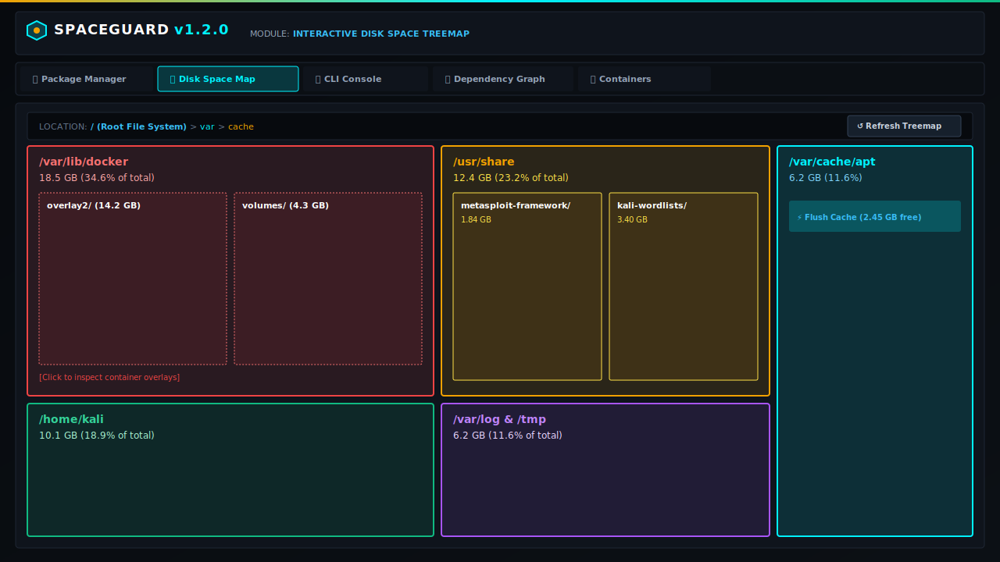
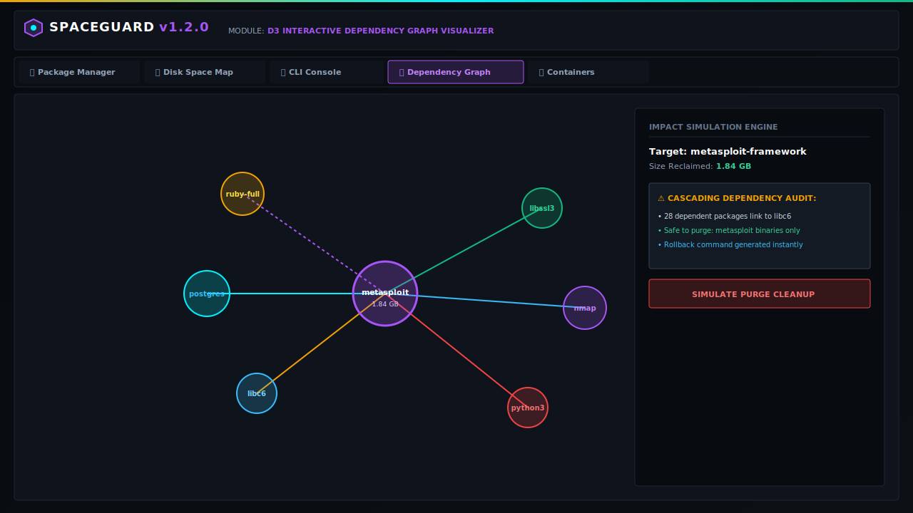
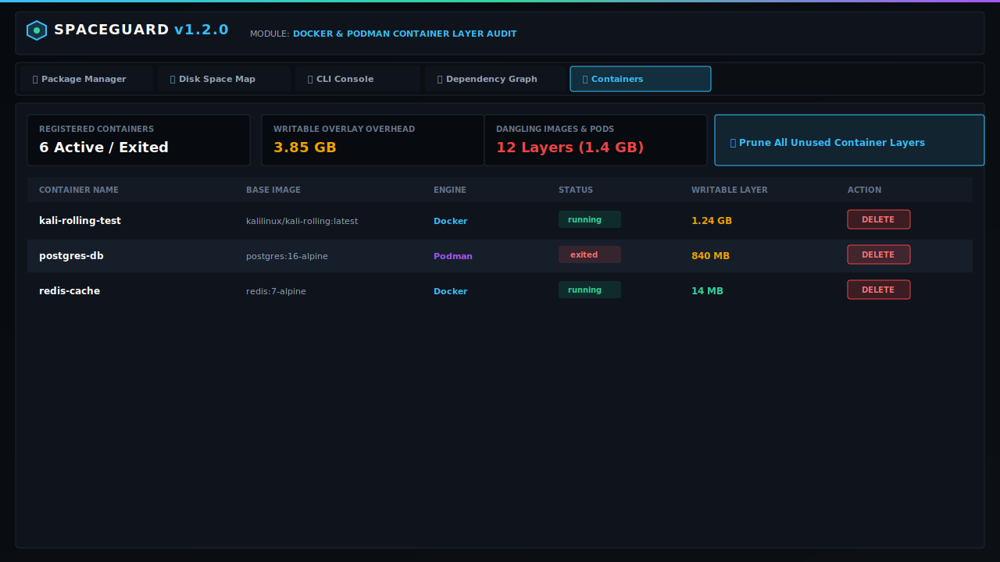
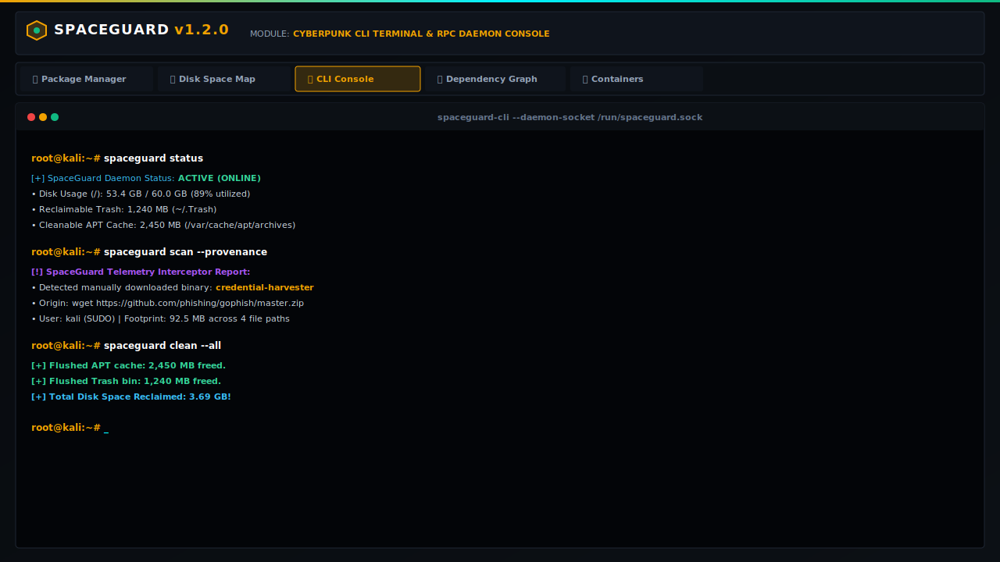

# SpaceGuard 🛡️

[](LICENSE)
[](https://www.debian.org/)
[]()
[]()
[](https://github.com/MutantMonx/SpaceGuard/releases)

> **Lightweight Disk Space & Comprehensive Dependency Optimizer for Linux & macOS Systems**
> **Created by [monx.one](https://monx.one/)**

SpaceGuard is an intelligent, low-footprint system utility designed specifically for Debian, Kali Linux, Ubuntu, and macOS environments. Built on a strict **"Monitor Everything"** policy, SpaceGuard captures and categorizes 100% of data occupying disk storage — including system packages (`apt`/`brew`), custom binary downloads (`wget`/`curl`), Docker & Podman container layers, system caches, user trash bins, and external USB ingests.

---

## 🌟 Key Features

### 🗺️ Interactive Disk Space Map & Treemap
- **Folder & Application Modes:** Switch seamlessly between directory hierarchy breakdown (`/usr`, `/var`, `/home`, `/opt`, `~/Library`, `/tmp`) and granular application/download tiles.
- **Hover & Metrics Summary:** View exact disk footprint (MB/GB), percentage of used storage, path location, first discovered date, and last access date on hover.
- **Contextual Actions:** Right-click any tile to copy paths, inspect dependencies in the D3 graph, quick-clean/purge resources, or add items to the protected safeguard exclude list.

### 🔍 Deep Scan & Live Resource Audit
- **Factual Disk State Audit:** Scans system packages (`dpkg`/`brew`), `/var/cache/apt/archives`, `~/Library/Caches`, user Trash bins, custom downloads, and USB ingests.
- **Container Runtime Scrapers:** Detects dangling Docker, Podman & OrbStack overlay images (`/var/lib/docker/overlay2`, `~/.orbstack`), exited containers, and unused pods.
- **Zero-Wait Ingestion:** Immediately indexes pre-existing tools and downloads on filled disks without waiting for background event triggers.

### 🕸️ Interactive Dependency Graph (D3-Powered)
- **Shared Library Linkage Visualization:** Displays real-time relationships between installed software and shared libraries (`libc6`, `libssl3`, `.so` / `.dylib`).
- **Impact Simulation:** Visualizes cascading dependency removals before executing destructive commands.

### 🍏 Cross-Platform macOS & Linux Support
- **Dedicated macOS Suite:** Includes Homebrew Formula (`macos/Formula/spaceguard.rb`), automated installer (`macos/install.sh`), and Apple `launchd` daemon agent (`com.monx.spaceguard.daemon.plist`).
- **Native macOS Targets:** Cleans Xcode DerivedData, Homebrew caches, and APFS user trash. Detailed guide available at [`docs/MACOS_INSTALLATION.md`](docs/MACOS_INSTALLATION.md).

---

## 📸 Screenshots & Application Gallery

### 1. Main Dashboard & Provenance Telemetry Audit
Live tracking of system disk space, installed packages, and deep origin tracking for manually downloaded binaries (`wget`/`curl`).


### 2. Interactive Disk Space Map & Folder Hierarchy
Hierarchical treemap breakdown of space-heavy directories (`/var/lib/docker`, `/usr/share`, `/home/kali`, `/var/cache`).



### 3. D3 Dependency Graph & Impact Simulator
Visual link analyzer showing library cross-dependencies and simulating cascading removals prior to executing commands.



### 4. Docker & Podman Container Layer Audit
Real-time container engine inspection, identifying writable layer bloat, stopped pods, and dangling images.



### 5. Cyberpunk CLI Console & Daemon Socket RPC
Embedded terminal console allowing direct control over the background SpaceGuard RPC daemon socket.



---

## 🚀 Quick Installation

### 🐧 Debian / Kali Linux / Ubuntu

#### Method 1: Install Pre-built `.deb` Package (Recommended)

Download the pre-compiled `.deb` package directly from the repo:

```bash
# Download the package
wget https://github.com/MutantMonx/SpaceGuard/raw/main/pkg/spaceguard_1.2.0_amd64.deb

# Install via dpkg
sudo dpkg -i spaceguard_1.2.0_amd64.deb

# Resolve any missing dependencies automatically
sudo apt-get install -f
```

---

#### Method 2: Add SpaceGuard APT Repository

```bash
# Add SpaceGuard repository key and source
echo "deb [trusted=yes] https://raw.githubusercontent.com/MutantMonx/SpaceGuard/main/pkg/ ./" | sudo tee /etc/apt/sources.list.d/spaceguard.list

# Update APT package indexes & install
sudo apt update
sudo apt install spaceguard
```

---

### 🍏 macOS (Apple Silicon & Intel)

#### Option A: Homebrew Formula (Recommended)

```bash
# Tap and install via Homebrew
brew tap mutantmonx/spaceguard https://github.com/MutantMonx/SpaceGuard
brew install spaceguard

# Start launchd service
brew services start spaceguard
```

#### Option B: 1-Line Automated macOS Installer Script

```bash
curl -fsSL https://raw.githubusercontent.com/MutantMonx/SpaceGuard/main/macos/install.sh | bash
```

> 📖 **Full macOS documentation:** See [`docs/MACOS_INSTALLATION.md`](docs/MACOS_INSTALLATION.md) for launchd configuration, Xcode cache purge commands, and Homebrew integration.

---

### 💻 Run from Source (Development)

Ensure Node.js (v18+) is installed on your system:

```bash
# Clone the repository
git clone https://github.com/MutantMonx/SpaceGuard.git
cd SpaceGuard

# Install dependencies & start dev mode
npm install
npm run dev
```

To build for production:

```bash
npm run build
npm start
```

---

## 💻 CLI Commands (`spaceguard`)

SpaceGuard includes a command-line interface mimicking the daemon socket RPC:

| Command | Description |
| :--- | :--- |
| `spaceguard status` | Display disk usage breakdown, daemon health, and memory footprint. |
| `spaceguard scan` | Run a deep diagnostic scan across system packages, containers, and trash. |
| `spaceguard clean` | Flush APT / Homebrew package cache and user trash bins. |
| `spaceguard clean-mac` | *(macOS only)* Purge Homebrew cache, Xcode DerivedData, and `~/.Trash`. |
| `spaceguard autoremove` | Purge orphaned packages and unlinked shared libraries. |
| `spaceguard containers prune` | Remove dangling Docker/Podman/OrbStack images and stopped containers. |

---

## 🛠️ Building Packages (`.deb` & macOS)

### Debian Package (.deb):
Run the build script directly or via API endpoint:
```bash
bash build-deb.sh
```
Output: `pkg/spaceguard_1.2.0_amd64.deb`

### macOS Directory Structure (`macos/`):
```
macos/
├── Formula/spaceguard.rb          # Homebrew Formula
├── com.monx.spaceguard.daemon.plist # Apple launchd service plist
├── install.sh                    # Automated 1-step installer
└── uninstall.sh                  # Automated uninstaller
```

---

## 📄 License

Distributed under the **Apache License 2.0**. See [`LICENSE`](LICENSE) for details.

---

## 🤝 Contributing

Contributions, bug reports, and feature requests are welcome! Feel free to check the [issues page](https://github.com/MutantMonx/SpaceGuard/issues).

Developed with ❤️ for Debian, Kali Linux & macOS power users.
