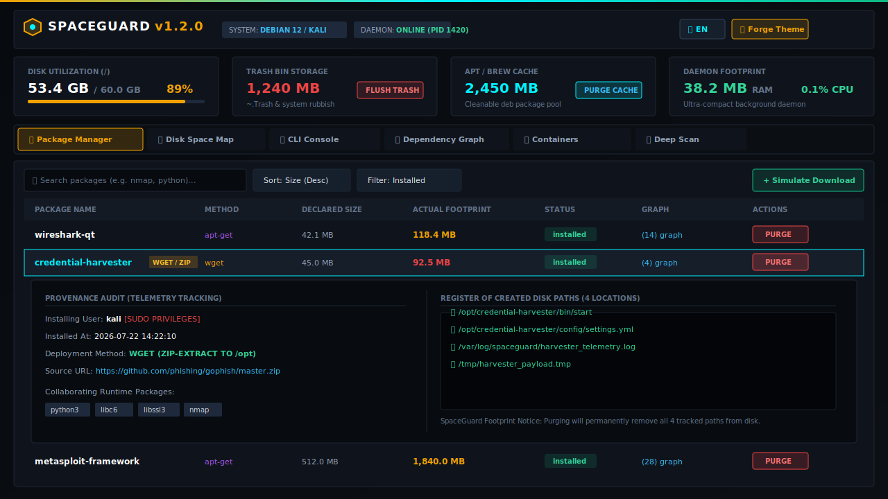

# SpaceGuard on macOS 🍏
## Installation & Configuration Guide

SpaceGuard v1.2.0 fully supports **macOS (Apple Silicon M1/M2/M3/M4 & Intel x86_64)**.



---

## 🌟 macOS Specific Features & Storage Targets

When running on macOS, SpaceGuard extends its audit engine to monitor native macOS storage consumers:

- **Homebrew Cache:** `~/Library/Caches/Homebrew`
- **Xcode Build Artifacts & DerivedData:** `~/Library/Developer/Xcode/DerivedData`
- **User Trash Bin:** `~/.Trash`
- **Containers:** Docker Desktop & OrbStack layer storage (`~/Library/Containers/com.docker.docker`, `~/.orbstack`)
- **APFS Snapshots & System Caches:** Root mount `/` disk map breakdown via native APFS metrics

---

## 🚀 Installation Methods

### Method 1: Homebrew Package Manager (Recommended)

If you have [Homebrew](https://brew.sh) installed on your Mac, you can install SpaceGuard using Homebrew Formula or Tap:

```bash
# 1. Tap the official SpaceGuard repository
brew tap mutantmonx/spaceguard https://github.com/MutantMonx/SpaceGuard

# 2. Install spaceguard
brew install spaceguard

# 3. Start SpaceGuard background service (launchd)
brew services start spaceguard
```

To stop or restart the service via Homebrew:
```bash
brew services restart spaceguard
brew services stop spaceguard
```

Once started, open **[http://localhost:3000](http://localhost:3000)** in Safari or Chrome.

---

### Method 2: One-Line Automated macOS Installer Script

You can run the official automated installer script in Terminal:

```bash
curl -fsSL https://raw.githubusercontent.com/MutantMonx/SpaceGuard/main/macos/install.sh | bash
```

**What this script does:**
1. Checks for Node.js (installs via Homebrew if missing).
2. Clones SpaceGuard into `/usr/local/share/spaceguard`.
3. Compiles the web application and server executable.
4. Creates executable launcher at `/usr/local/bin/spaceguard`.
5. Configures and registers Apple `launchd` agent (`com.monx.spaceguard.daemon.plist`).
6. Starts the background daemon listening on `http://localhost:3000`.

---

### Method 3: Manual Installation from Source

If you prefer building from source:

```bash
# 1. Clone the repository
git clone https://github.com/MutantMonx/SpaceGuard.git
cd SpaceGuard

# 2. Install dependencies & build
npm install
npm run build

# 3. Start production server
npm start
```

#### Registering launchd Daemon manually:
```bash
cp macos/com.monx.spaceguard.daemon.plist ~/Library/LaunchAgents/
launchctl load ~/Library/LaunchAgents/com.monx.spaceguard.daemon.plist
```

---

## 💻 macOS CLI Commands

SpaceGuard provides macOS terminal helper commands:

| Command | Action |
| :--- | :--- |
| `spaceguard status` | View disk storage usage, active daemon status, and memory consumption. |
| `spaceguard scan` | Run deep diagnostic scan across macOS caches, containers, and trash. |
| `spaceguard clean-mac` | Instantly purge Homebrew cache, Xcode DerivedData, and user Trash bin. |
| `spaceguard containers prune` | Prune OrbStack / Docker Desktop dangling container layers. |

---

## 🗑️ Uninstallation

To cleanly remove SpaceGuard from macOS:

```bash
# If installed via Homebrew:
brew uninstall spaceguard

# If installed via install.sh or manual script:
curl -fsSL https://raw.githubusercontent.com/MutantMonx/SpaceGuard/main/macos/uninstall.sh | bash
```
